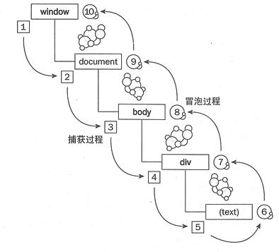

# DOM 

 - DOM 事件的级别
 - DOM 事件模型
 - DOM 事件流
 - DOM 事件捕获的具体流程
 - Event 对象的常见应用
 - 自定义事件

[DOM概述 | MDN](https://developer.mozilla.org/zh-CN/docs/Web/API/Document_Object_Model/Introduction)

[DOM | MDN](https://developer.mozilla.org/zh-CN/docs/Web/API/Element)

[DOM操作](https://blog.csdn.net/Night_Emperor/article/details/78471051)


### DOM事件级别
 - DOM0
   - onXXX类型的定义事件
   - element.onclick = function(e) { ... }
 - DOM2
   - addEventListener方式
   - element.addEventListener('click', function (e) { ... })
   - btn.removeEventListener('click', func, false)
   - btn.attachEvent("onclick", func);
   - btn.detachEvent("onclick", func);
 - DOM3
   - 增加了很多事件类型
   - element.addEventListener('keyup', function (e) { ... })
   - eventUtil 是自定义对象，textInput 是 DOM3 级事件


### DOM 事件模型
捕获从上到下， 冒泡从下到上。
先捕获，再到目标，再冒泡



### DOM事件流
DOM标准采用捕获+冒泡。两种事件流都会触发DOM的所有对象，从window对象开始，也在window对象结束。

DOM标准规定事件流包括三个阶段：
 - 事件捕获阶段
 - 处于目标阶段
 - 事件冒泡阶段


### 描述DOM事件捕获的具体流程

从window -> document -> html -> body -> ... -> 目标元素


### Event对象常见应用
 - event.target
   - 触发事件的元素
 - event.currentTarget
   - 绑定事件的元素
 - event.preventDefault()
   - 阻止默认行为
   - event.cancelBubble()和event.preventBubble 都已经废弃
 - event.stopPropagation()
   - 阻止在捕获阶段或冒泡阶段继续传播，而不是阻止冒泡
 - event.stopImmediatePropagation()
   - 阻止事件冒泡并且阻止相同事件的其他侦听器被调用。


### 事件的代理/委托
事件委托是指将事件绑定目标元素的到父元素上，利用冒泡机制触发该事件

优点：

 - 可以减少事件注册，节省大量内存占用
 - 可以将事件应用于动态添加的子元素上

但使用不当会造成事件在不应该触发时触发
```js
ulEl.addEventListener('click', function(e){
  var target = event.target || event.srcElement;
  if(target && target.nodeName.toUpperCase() === "LI"){
    console.log(target.innerHTML);
  }
}, false);
```


### 自定义事件

 - Event
 - CustomEvent

CustomEvent不仅可以用来做自定义事件，还可以在后面跟一个object做参数

```js
var evt = new Event('myEvent');

someDom.addEventListener('myEvent', function() {
  //处理这个自定义事件
});

someDom.dispatchEvent(evt);
```


### IE 与火狐的事件机制有什么区别？ 如何阻止冒泡？

IE 只事件冒泡，不支持事件捕获；火狐同时支持件冒泡和事件捕获。

阻止冒泡：

 - 取消默认操作
   - w3c 的方法是 e.preventDefault()
   - IE 则是使用 e.returnValue = false;
 - return false 
   - javascript 的 return false 只会阻止默认行为
   - 是用 jQuery 的话则既阻止默认行为又防止对象冒泡。
 - 阻止冒泡 
   - w3c 的方法是 e.stopPropagation()
   - IE 则是使用 e.cancelBubble = true

```js
[js] view plaincopy
function stopHandler(event)
  window.event 
  ? window.event.cancelBubble = true 
  : event.stopPropagation();
}
```


### JS获取dom的CSS样式

```js
function getStyle(obj, attr){
  if(obj.currentStyle){
    return obj.currentStyle[attr];
  } else {
    return window.getComputedStyle(obj, false)[attr];
  }
}
```


### [JS实现鼠标拖拽](https://blog.csdn.net/qq_37746973/article/details/80748879)


### DOM 操作——怎样添加、移除、移动、复制、创建和查找节点?

创建新节点

 - createDocumentFragment() //创建一个 DOM 片段
 - createElement() //创建一个具体的元素
 - createTextNode() //创建一个文本节点

添加、移除、替换、插入

 - appendChild()
 - removeChild()
 - replaceChild()
 - insertBefore() //在已有的子节点前插入一个新的子节点

查找

 - getElementsByTagName() //通过标签名称
 - getElementsByName() // 通过元素的 Name 属性的值(IE 容错能力较强，会得到一个数组，其中包括 id 等于 name 值的)  
 - getElementById() //通过元素 Id，唯一性


### documen.write 和 innerHTML 的区别

 - document.write 只能重绘整个页面
 - innerHTML 可以重绘页面的一部分


### Window 对象 与 document对象

window
 - Window 对象表示当前浏览器的窗口，是 JavaScript 的顶级对象。
 - 我们创建的所有对象、函数、变量都是 Window 对象的成员。
 - Window 对象的方法和属性是在全局范围内有效的。

document
 - Document 对象是 HTML 文档的根节点与所有其他节点（元素节点，文本节点，属性节点, 注释节点）
 - Document 对象使我们可以通过脚本对 HTML 页面中的所有元素进行访问
 - Document 对象是 Window 对象的一部分，即 window.document


### 区分什么是“客户区坐标”、“页面坐标”、“屏幕坐标” 

 - 客户区坐标
   - 鼠标指针在可视区中的水平坐标(clientX)和垂直坐标(clientY)
 - 页面坐标
   - 鼠标指针在页面布局中的水平坐标(pageX)和垂直坐标
 - 屏幕坐标
   - 设备物理屏幕的水平坐标(screenX)和垂直坐标(screenY)


### focus/blur与focusin/focusout的区别与联系

1. focus/blur不冒泡，focusin/focusout冒泡
2. focus/blur兼容性好，focusin/focusout在除FireFox外的浏览器下都保持良好兼容性，如需使用事件托管，可考虑在FireFox下使用事件捕获elem.addEventListener('focus', handler, true)


### mouseover/mouseout与mouseenter/mouseleave的区别与联系

1. mouseover/mouseout是标准事件，**所有浏览器都支持**；mouseenter/mouseleave是IE5.5引入的特有事件后来被DOM3标准采纳，现代标准浏览器也支持
2. mouseover/mouseout是**冒泡**事件；mouseenter/mouseleave**不冒泡**。需要为**多个元素监听鼠标移入/出事件时，推荐mouseover/mouseout托管，提高性能**
3. 标准事件模型中event.target表示发生移入/出的元素,**vent.relatedTarget**对应移出/如元素；在老IE中event.srcElement表示发生移入/出的元素，**event.toElement**表示移出的目标元素，**event.fromElement**表示移入时的来源元素


### IE 的事件处理和 W3C 的事件处理有哪些区别？

绑定事件

 - W3C: targetEl.addEventListener('click', handler, false);
 - IE: targetEl.attachEvent('onclick', handler);

删除事件

 - W3C: targetEl.removeEventListener('click', handler, false);
 - IE: targetEl.detachEvent(event, handler);

事件对象

 - W3C: var e = arguments.callee.caller.arguments[0]
 - IE: window.event

事件目标

 - W3C: e.target
 - IE: window.event.srcElement

阻止事件默认行为

 - W3C: e.preventDefault()
 - IE: window.event.returnValue = false'

阻止事件传播

 - W3C: e.stopPropagation()
 - IE: window.event.cancelBubble = true