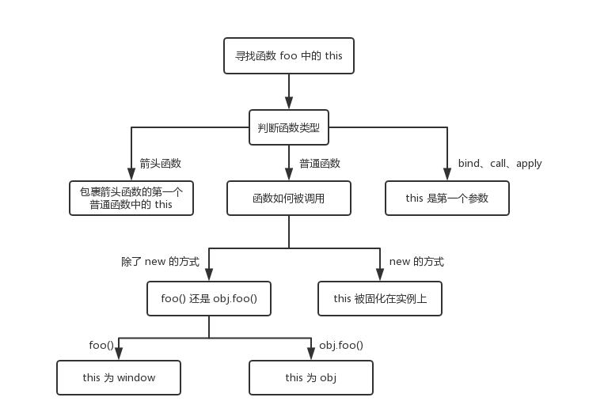

# this

### this的指向有哪几种情况？
this代表函数调用相关联的对象，通常页称之为执行上下文。

1. 作为函数直接调用，非严格模式下，this指向window，严格模式下，this指向undefined；
2. 作为某对象的方法调用，this通常指向调用的对象。
3. 使用apply、call、bind 可以绑定this的指向。
4. 在构造函数中，this指向新创建的对象
5. 箭头函数没有单独的this值，this在箭头函数创建时确定，它与声明所在的上下文相同。


### 如果对一个函数进行多次 bind，那么上下文会是什么呢？

```js
let a = {}
let fn = function () { console.log(this) }
fn.bind().bind(a)() // => ?
```
不管我们给函数 bind 几次，fn 中的 this 永远由第一次 bind 决定，所以结果永远是 window。
```js
// fn.bind().bind(a) 等于
let fn2 = function fn1() {
  return function() {
    return fn.apply()
  }.apply(a)
}
fn2()
```


### 多个this规则出现时，this最终指向哪里？
首先，new 的方式优先级最高，接下来是 bind 这些函数，然后是 obj.foo() 这种调用方式，最后是 foo 这种调用方式，同时，箭头函数的 this 一旦被绑定，就不会再被任何方式所改变。



```js
function Foo(){
    this.name='kkk';
    this.year=2019;
    console.log(this);//window
    console.log(this.year)//2019
}
Foo()
```

```js
function Foo(){
    this.name='kkk';
    this.year=2019;
    console.log(this);  //Foo{name:'kkk',year:2019}
    console.log(this.year)//2019
}
var a=new Foo();
console.log(a.name)//'kkk'
console.log(a.year)//2019

```

### 直接调用构造函数的this与new的对象的this不一样
```js
var obj={
    x:10,
    fn:function(){
        console.log(this);
        console.log(this.x)
    }
}

obj.fn();
//{ x: 10, fn: [Function: fn] }
//10
```

### 函数作为对象的一个属性，并且作为对象的一个属性被调用时，函数中的this指向该对象。
```js
var obj={
    x:10,
    fn:function(){
        console.log(this);
        console.log(this.x)
    }
}

f=obj.fn;
f();
//window
//undefined

// fn函数被赋值到了另一个变量中,并没有作为obj的一个属性被调用，那么this的值就是window，this.x为undefined
```

```js
// 默认绑定
function girl (){
    console.log(this);  //window
}
girl();


// 隐式绑定
var girl={
    name:'小红',
    height:160,
    weight:180,
    detail:function(){
        console.log('姓名'+this.name); //小红
        console.log('身高'+this.height) //160
    }
}
girl.detail()

// 硬绑定
var girlName={
    name:"小红",
    sayName:function(){
        console.log('我的女朋友是'+this.name)
    },
}
var girl1={
    name:"小白"
}
var girl2={
    name:"小黄"
}
girlName.sayName.call(girl1);  //小白
girlName.sayName.call(girl2);  //小黄


//构造函数绑定
function Love(name){
    this.name=name;
    this.sayName=function(){
        console.log('我的老婆是'+this.name);  //小红
    };
}

var name='小白',
var xiaoHong=new Lover('小红');
xiaoHong.sayName();


function a(){
    function b(){
        console.log(this);  //window
        function c(){
            "use strict";
            console.log(this);  //undefined
        }
        c();
    }
    b();
}
a();


var name='小白';
function special(){
    console.log('姓名:'+this.name);
}

var girl ={
    name:'小红',
    detail:function(){
        console.log('姓名'+this.name);
    },
    woman:{
        name:'小黄',
        detail:function(){
            console.log('姓名'+this.name);
        }
    }
    special:special
}
girl.detail();   //小红
girl.woman.detail();     //小黄
girl.special();    //小红

```

```js
var name ='小红';
function a(){
    var name ='小白';
    console.log(this.name);
}
function d(i){
    return i();
}
var b={
    name:'小黄',
    detail:function(){
        console.log(this.name);
    },
    bibi:function(){
        return function(){
            console.log(this.name);
        };
    };
}
var c=b.detail;
b.a=a;
var e=b.bibi();
a();   //小红
c();   //小红
b.a();  //小黄
d(b.detail);  //小红
e();  //小红

```

```js
var num = 1;
var myObject = {
    num: 2,
    add: function() {
        this.num = 3;
        (function() {
            console.log(this.num); //默认绑定  指向的window   输出1
            this.num = 4;
        })();
        console.log(this.num);   
    },
    sub: function() {
        console.log(this.num)
    }
}
myObject.add();         //undefined 3
console.log(myObject.num);  //3
console.log(num);  //1
var sub = myObject.sub;
sub();  //4
```