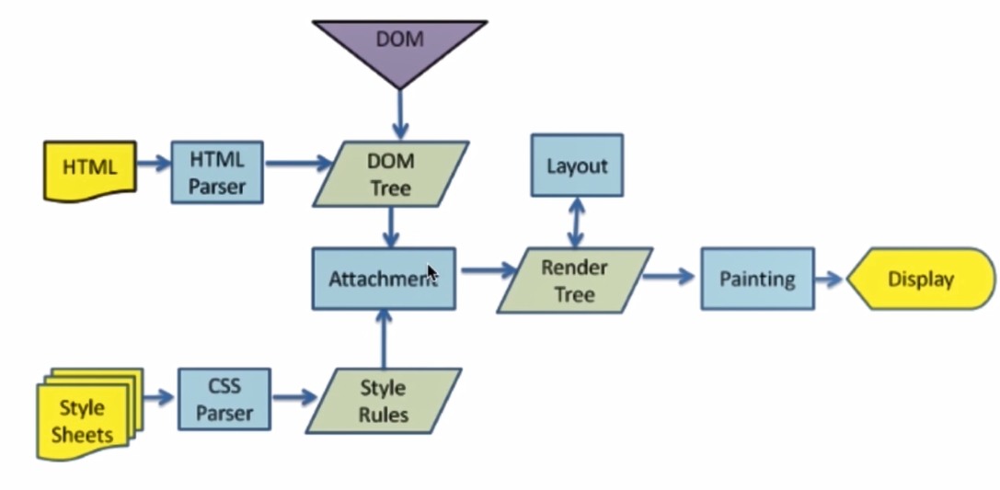

### 浏览器的渲染过程，DOM 树和渲染树的区别？

HTML 经过解析生成 DOM树； CSS经过解析生成　Style Rules。 二者一结合生成了Render Tree。
通过layout计算出DOM要显示的宽高、位置、颜色。
最后渲染在界面上，用户就看到了

浏览器的渲染过程：

 - 解析 HTML 构建 DOM(DOM 树)，并行请求 css/image/js
 - CSS 文件下载完成，开始构建 CSSOM(CSS 树)
 - CSSOM 构建结束后，和 DOM 一起生成 Render Tree(渲染树)
 - 布局(Layout)：计算出每个节点在屏幕中的位置
 - 显示(Painting)：通过显卡把页面画到屏幕上

DOM 树 和 渲染树 的区别：

 - DOM 树与 HTML 标签一一对应，包括 head 和隐藏元素
 - 渲染树不包括 head 和隐藏元素，大段文本的每一个行都是独立节点，每一个节点都有对应的 css 属性

### CSS会阻塞DOM解析吗？

对于一个HTML文档来说，不管是内联还是外链的css，都会阻碍后续的dom渲染，但是不会阻碍后续dom的解析。

当css文件放在<head>中时，虽然css解析也会阻塞后续dom的渲染，但是在解析css的同时也在解析dom，所以等到css解析完毕就会逐步的渲染页面了。

